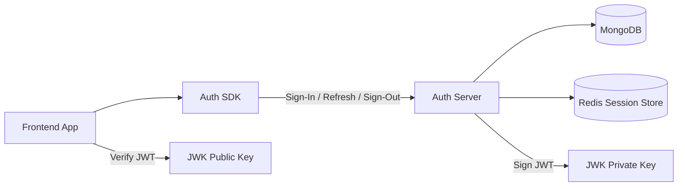
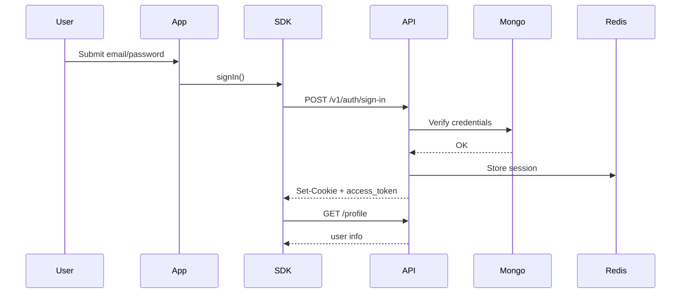
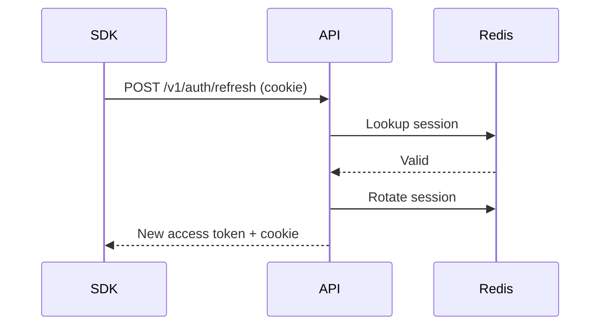

# **AuthFlow – Complete Authentication System (Express + MongoDB + Redis + JWT + React SDK)**

AuthFlow is a **fully-featured, extensible, and beautiful authentication system** inspired by Clerk / Auth0 — built from scratch using:

* **Node.js + Express**
* **MongoDB** for user storage
* **Redis** for secure session token management
* **JWT (RS256)** for stateless access tokens
* **React + TypeScript SDK** with pre-built UI components
* **Auto-refresh** on page reload
* **Session rotation** and multi-device support
* **Beautiful UI components (extensible)**
* **Production-grade architecture & optimization**

AuthFlow is structured to be:

* **Secure**
* **Fast**
* **Plug-and-play**
* **Customizable**
* **Scalable**

Use it to integrate a full authentication system into any frontend.

---

# 🖥️ **Features**

### 🔐 Authentication Engine

* Email + password sign-in
* Secure session management using Redis
* Refresh token rotation
* HttpOnly cookies
* JWT access tokens
* RS256 signing with JWK keys
* Multi-device session support

### 🧩 React SDK

* `<AuthProvider />`
* `<SignIn />`
* `<SignUp />`
* `<SignOutButton />`
* `useAuth()` hook
* Auto-refresh + session persistence
* Full TypeScript support

### 🎨 Beautiful Tailwind UI (Extensible)

* Custom styled modal forms
* Fully responsive
* Accessible
* Validation states
* Error messaging
* Loading indicators

### 📈 Optimized System

* Fast Redis access (O(1) session lookup)
* Minimal DB load
* Stateless access token validation
* Scales horizontally
* Pre-configured for production CORS, cookies, and HTTPS

### 🔧 Easily Extensible

* Add OAuth (Google/GitHub)
* Add MFA (TOTP/SMS)
* Add Webhooks
* Add Admin Dashboard
* Add Device Management Page

---

# 🗂️ **Project Structure**

```
AuthFlow/
│
├── packages/
│   ├── auth-server/      # Express backend
│   └── auth-sdk/         # React SDK
│
└── test-app/             # React app demonstrating SDK usage
```

---

# 🔐 **Authentication Architecture**



---

# 🔄 **Sequence Diagrams**

## **Sign-In Flow**



## **Refresh Token Flow**



---

# 📡 **Backend Routes**

### **POST /v1/auth/register**

### **POST /v1/auth/sign-in**

### **POST /v1/auth/refresh**

### **POST /v1/auth/sign-out**

### **GET /profile**

All routes requiring auth expect:

```
Authorization: Bearer <access_token>
```

---

# 💾 **Backend Setup**

```bash
cd packages/auth-server
npm install
npm run dev
```

### `.env`

```env
PORT=4000
MONGO_URI=mongodb://localhost:27017/authflow
JWT_ISSUER=http://localhost:4000
ACCESS_TOKEN_EXP=900
REFRESH_TOKEN_TTL=604800
REDIS_URL=redis://localhost:6379
```

---

# 🧠 **React SDK Integration**

### 1️⃣ Install SDK

```bash
npm install auth-sdk
```

Or local path:

```bash
npm install "../packages/auth-sdk"
```

### 2️⃣ Wrap your App

```tsx
<AuthProvider authUrl="http://localhost:4000">
  <App />
</AuthProvider>
```

### 3️⃣ Use Components

```tsx
<SignIn />
<SignUp />
<SignOutButton />
```

### 4️⃣ Use Session Hook

```tsx
const { user, loading, signOut, refreshSession } = useAuth();
```

---

# 🎨 **UI Components Included**

### ✔ Modern Tailwind UI

### ✔ Error states

### ✔ Loading spinners

### ✔ Beautiful input fields

### ✔ Dark-mode friendly

### ✔ Fully customizable

### ✔ Works anywhere in your app

Example:

```tsx
<SignIn />  
<SignUp />  
<SignOutButton />  
```

---

# 🧩 **API Examples (cURL + JS)**

### Register

```bash
curl -X POST http://localhost:4000/v1/auth/register \
  -H "Content-Type: application/json" \
  -d '{"email":"demo@example.com","password":"password","name":"Demo"}'
```

### Sign In

```js
axios.post("http://localhost:4000/v1/auth/sign-in",
  {email, password},
  {withCredentials: true}
);
```

### Refresh

```bash
curl -X POST http://localhost:4000/v1/auth/refresh \
  -b cookie.txt -c cookie.txt
```

### Profile

```js
axios.get("http://localhost:4000/profile", {
  headers: { Authorization: `Bearer ${access}` }
});
```

### Sign Out

```js
axios.post("http://localhost:4000/v1/auth/sign-out", {}, {withCredentials: true});
```

---

# ⚙️ **Performance Optimizations**

### Backend

* Redis for O(1) session lookup
* Minimal DB reads
* Only hashed refresh tokens stored
* Rotating tokens prevent replay attacks

### Frontend

* Access tokens stored in React state (not localStorage)
* Automatic refresh throttle
* Lazy-loaded profile fetch
* Memoized context values

---

# 🛡️ **Security Features**

* HttpOnly cookies
* SameSite Lax to prevent CSRF
* RS256 asymmetric JWT signing
* Refresh token rotation
* Session revocation in Redis
* No sensitive data stored on client
* Custom session IDs per device

---

# 🧭 **Future Roadmap (UI + Features)**

### 🎨 Beautiful UI Enhancements

* Animated modal windows
* Fully themable components
* Inputs with iconography
* Success/error states
* Password strength meters
* User drop-down avatar menu
* Toast notifications

### 🚀 Major Feature Additions

* Google OAuth
* GitHub OAuth
* Magic Link Login
* Password Reset
* Email Verification
* Admin Dashboard
* Session history + device management
* Rate-limiting + brute-force protection

### 🧩 SDK Improvements

* Support for Next.js App Router
* Custom redirect callbacks
* Guarded routes (`<SignedIn />`, `<SignedOut />`)
* SSR-safe session checking

---

# 🏁 **Conclusion**

AuthFlow is:

* A modern, secure, production-grade authentication backend
* A polished and extensible React SDK
* A fully customizable front-end UI
* A scalable Redis-backed session system
* A complete Clerk-like local authentication provider

This project demonstrates your mastery in:

* Node.js
* Express
* MongoDB
* Redis
* JWT
* JWK
* Client SDK design
* React + TypeScript
* Authentication architecture
* Security best practices
